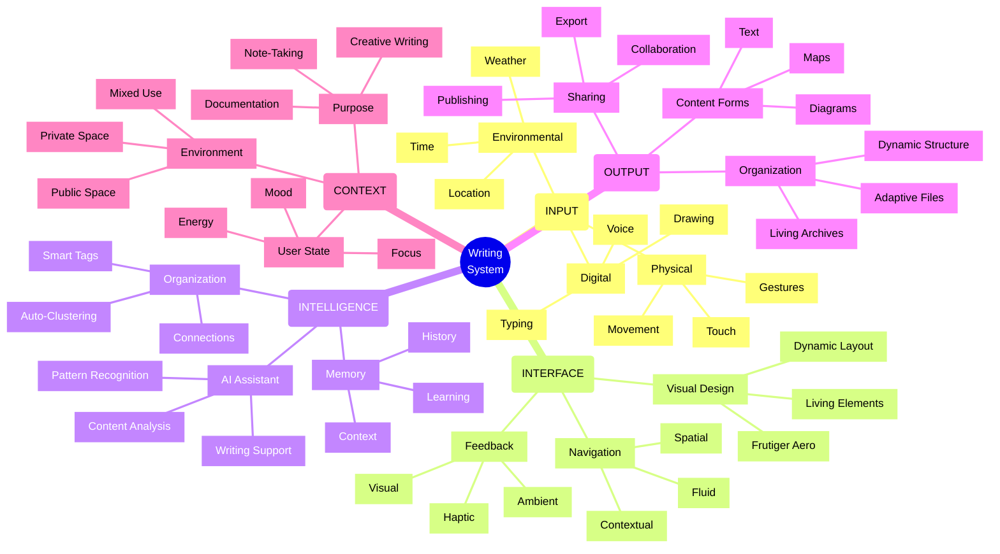

# Diving in

```mermaid
mindmap
    root((Writing
        System))
        (INPUT)
            [Physical]
                [Gestures]
                [Touch]
                [Movement]
            [Digital]
                [Typing]
                [Voice]
                [Drawing]
            [Environmental]
                [Location]
                [Time]
                [Weather]
        (INTERFACE)
            [Visual Design]
                [Frutiger Aero]
                [Living Elements]
                [Dynamic Layout]
            [Navigation]
                [Spatial]
                [Contextual]
                [Fluid]
            [Feedback]
                [Ambient]
                [Haptic]
                [Visual]
        (INTELLIGENCE)
            [AI Assistant]
                [Writing Support]
                [Content Analysis]
                [Pattern Recognition]
            [Organization]
                [Auto-Clustering]
                [Smart Tags]
                [Connections]
            [Memory]
                [History]
                [Context]
                [Learning]
        (OUTPUT)
            [Content Forms]
                [Text]
                [Diagrams]
                [Maps]
            [Organization]
                [Dynamic Structure]
                [Living Archives]
                [Adaptive Files]
            [Sharing]
                [Collaboration]
                [Publishing]
                [Export]
        (CONTEXT)
            [Environment]
                [Public Space]
                [Private Space]
                [Mixed Use]
            [User State]
                [Mood]
                [Focus]
                [Energy]
            [Purpose]
                [Creative Writing]
                [Note-Taking]
                [Documentation]
```
# Ways of Writing/Taking Notes

